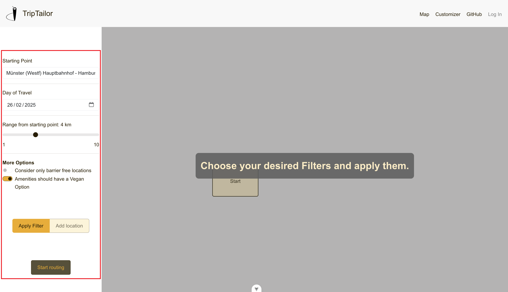

# TripTailor

## Description

TripTailor is an open-source, automated trip planner that personalizes travel itineraries by recommending locations and activities based on user interests, leveraging geospatial data and external APIs for optimized route navigation. Currently in its test stages and limited to the city of Münster, the project addresses the challenge of time-consuming travel planning by simplifying the process for tourists, local businesses, and tourism centers, ensuring efficient and tailored trip experiences.

The docker compose file of the project is based on the following GitHub repositories:
- [Webclient](https://github.com/TripTailor-ifgi/webclient)
- [Backend](https://github.com/TripTailor-ifgi/backend)
- [Data Acquisition](https://github.com/TripTailor-ifgi/data_acquisition)

## Requirements

1. This project is based on Docker. If necessary, please download the [Docker Desktop App](https://www.docker.com/products/docker-desktop/).
2. To be able to use the project, a [OpenRouteService API key](https://openrouteservice.org/) is necessary. Replace the plaeeholder `<YOUR API KEY>` with the acutal key in the .env file.

## Installation

### Clone the repository

```bash
git clone https://github.com/TripTailor-ifgi/TripTailor.git
cd TripTailor
```

### Run the docker-compose.yml

```bash
docker compose up -d
```

## Usage

Once the Docker containers are running, the web application can be accessed at [localhost](http://localhost:5173).

### 1. Start the Application  
The home page is the starting point. Click the **"Start Now"** button to begin.


### 2. Select Filters  
Choose the necessary filters, such as the starting point. Once selected, click **"Apply Filter"**.



### 3. Add Locations  
Select the desired locations for routing. When done, click **"Start Routing"**.


### 4. View and Adjust the Route  
The initial route will be displayed along with routing descriptions. Users can add or remove locations by clicking the visible icons.


## Credits

1. Contributors
   - Tobias Brank - [GitHub](https://github.com/TobiasBrand-GI)
   - Frederick Schindlegger - [GitHub](https://github.com/f-schi)
   - Wenhao Lan - [GitHub](https://github.com/whlan02)
   - Erkam Dogan - [GitHub](https://github.com/rkmd0)
   - Moritz Denk - [GitHub](https://github.com/denkmoritz)

2. Frameworks for Frontend, Backend & Database
    - Frontend
        - [Vue](https://vuejs.org/), [Vite](https://vite.dev/), [Pinia](https://pinia.vuejs.org/)
        - [Bootstrap](https://getbootstrap.com/)
        - [OpenLayers](https://openlayers.org/)
        - [Axios](https://axios-http.com/), [GSAP](https://gsap.com/)

    - Backend
        - [Flask](https://flask.palletsprojects.com/en/stable/), [Flask-Cors](https://pypi.org/project/Flask-Cors/)
        - [psycopg2](https://www.psycopg.org/docs/)

    - Database
        - [kartoza/postgis](https://hub.docker.com/r/kartoza/postgis/)

3. Third-Party Libraries & APIs
    - [basemap.de](https://basemap.de/)
    - [Komoot Photon Geocoding API](https://photon.komoot.io/)
    - Map Icons ([1](https://uxwing.com/), [2](https://icons.getbootstrap.com/), [3](https://www.svgrepo.com/))
    - [OpenRouteService API](https://openrouteservice.org/)
    - [OpenStreetMap Data for the City of Münster](https://opendata.stadt-muenster.de/dataset/openstreetmaps-rohdaten-f%C3%BCr-m%C3%BCnster)

## License

## Badges
