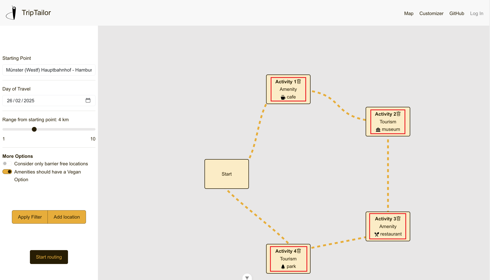

# TripTailor

## Description

TripTailor is an open-source, automated trip planner that personalizes travel itineraries by recommending locations and activities based on user interests, leveraging geospatial data and external APIs for optimized route navigation. Currently in its test stages and limited to the city of Münster, the project addresses the challenge of time-consuming travel planning by simplifying the process for tourists, local businesses, and tourism centers, ensuring efficient and tailored trip experiences.

The docker compose file of the project is based on the following GitHub repositories:
- [Webclient](https://github.com/TripTailor-ifgi/webclient)
- [Backend](https://github.com/TripTailor-ifgi/backend)
- [Data Acquisition](https://github.com/TripTailor-ifgi/data_acquisition)

## Requirements

1. This project is based on Docker. If necessary, please download the [Docker Desktop App](https://www.docker.com/products/docker-desktop/).
2. To be able to use the project, a [OpenRouteService API key](https://openrouteservice.org/) is necessary. Replace the placeholder <br> `<YOUR API KEY>` with the actual key in the .env file.

## Installation

### Clone the repository

```bash
git clone https://github.com/TripTailor-ifgi/TripTailor.git
cd TripTailor
```

### Run the docker-compose.yml

```bash
docker compose up -d
```

## Usage

Once the Docker containers are running, the web application can be accessed at [localhost](http://localhost:5173).

### 1. Start the Application  
The home page is the starting point. Click the **"Start Now"** button to begin.


### 2. Select Filters  
Choose the necessary filters, such as the starting point. Once selected, click **"Apply Filter"**.


### 3. Add Locations  
Select the desired locations for routing. When done, click **"Start Routing"**.



### 4. View and Adjust the Route  
The initial route will be displayed along with routing descriptions. Users can add or remove locations by clicking the visible icons. When a user clicks on a location, a **popup** appears, displaying **basic information** about the location along with a **button to either add or remove** it from the route, depending on whether it is already included.


## Credits

1. Contributors
   - Tobias Brand - [GitHub](https://github.com/TobiasBrand-GI)
   - Frederick Schindlegger - [GitHub](https://github.com/f-schi)
   - Wenhao Lan - [GitHub](https://github.com/whlan02)
   - Erkam Dogan - [GitHub](https://github.com/rkmd0)
   - Moritz Denk - [GitHub](https://github.com/denkmoritz)

2. Frameworks for Frontend, Backend & Database
    - Frontend
        - [Vue](https://vuejs.org/), [Vite](https://vite.dev/), [Pinia](https://pinia.vuejs.org/)
        - [Bootstrap](https://getbootstrap.com/)
        - [OpenLayers](https://openlayers.org/)
        - [Axios](https://axios-http.com/), [GSAP](https://gsap.com/)

    - Backend
        - [Flask](https://flask.palletsprojects.com/en/stable/), [Flask-Cors](https://pypi.org/project/Flask-Cors/)
        - [psycopg2](https://www.psycopg.org/docs/)

    - Database
        - [kartoza/postgis](https://hub.docker.com/r/kartoza/postgis/)

3. Third-Party Libraries & APIs
    - [basemap.de](https://basemap.de/)
    - [Komoot Photon Geocoding API](https://photon.komoot.io/)
    - Map Icons ([1](https://uxwing.com/), [2](https://icons.getbootstrap.com/), [3](https://www.svgrepo.com/))
    - [OpenRouteService API](https://openrouteservice.org/)
    - [OpenStreetMap Data for the City of Münster](https://opendata.stadt-muenster.de/dataset/openstreetmaps-rohdaten-f%C3%BCr-m%C3%BCnster)

## Research Papers
Before diving into the implementation phase of our project, we thoroughly explored relevant literature to ensure that our approach was grounded on good practices. The following papers were relevant in shaping our understanding:

-  Vansteenwegen, P., & Van Oudheusden, D. (2007). The Mobile Tourist Guide: An or opportunity. *OR Insight, 20*(3), 21–27. [https://doi.org/10.1057/ori.2007.17](https://doi.org/10.1057/ori.2007.17)

-  Makris, A., Tserpes, K., Spiliopoulos, G., & Anagnostopoulos, D. (2019). Performance Evaluation of MongoDB and PostgreSQL for Spatio-temporal Data. *EDBT/ICDT Workshops*

-  Cybulski, P., & Horbiński, T. (2020). User experience in using graphical user interfaces of web maps. *ISPRS International Journal of Geo-Information, 9*(7), 412. [https://doi.org/10.3390/ijgi9070412](https://doi.org/10.3390/ijgi9070412)

-  Quercia, D., Schifanella, R., & Aiello, L. M. (2014). The shortest path to happiness. *Proceedings of the 25th ACM Conference on Hypertext and Social Media*. [https://doi.org/10.1145/2631775.2631799](https://doi.org/10.1145/2631775.2631799)

-  Brown, A., Emmer, N., & van den Worm, J. (2001). Cartographic Design and Production in the Internet Era: The Example of Tourist Web Maps. *The Cartographic Journal, 38*(1), 61–72. [https://doi.org/10.1179/000870401787312921](https://doi.org/10.1179/000870401787312921)


## License
This project is licensed under the **Creative Commons Attribution-NonCommercial 4.0 International License (CC BY-NC 4.0)**.  
See the [LICENSE](./LICENSE.md) file for details.

### Third-Party Licenses:
This project also relies on external data sources and services with separate licensing:
- **OpenRouteService** (CC-BY 4.0)
- **basemap.de** (CC-BY 4.0 or DL-DE-BY-2.0)
- **OpenStreetMap** (ODbL)
- **Photon Geocoding API** (Apache 2.0)

Users of this software must comply with these third-party licenses when using the project.
